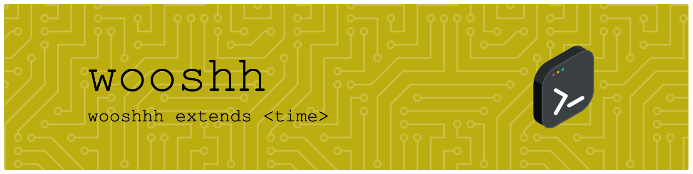

<p align="center">

</p>

<hr/>

# wooshh

**wooshh** is a replacement for `time` written in [Rust](https://www.rust-lang.org/).

[](https://github.com/mehuaniket/wooshh/actions/workflows/release.yml)
[](https://codecov.io/gh/mehuaniket/woosh)
[](https://github.com/mehuaniket/woosh/blob/master/CHANGELOG.md)
[](https://formulae.brew.sh/formula/wooshh)
<!-- [](https://crates.io/crates/wooshh) -->
<!-- [](https://snapcraft.io/wooshh) -->

## Documentation quick links

* [Features](#features)
* [Platform](#platform)
* [Installation](#installation)
* [Usage](#usage)
* [Configuration](#configuration)

## Features 

* Get time it took to run the command
* It plays sound when command finishes. You don't need to wait on the terminal.

## Platform 


* Linux is supported.
* macOS is experimentally supported.

## Installation


```
curl -LSfs https://japaric.github.io/trust/install.sh | sh -s -- --git mehuaniket/wooshh --tag v0.2.0
```

For mac os:

```
brew tap mehuaniket/tools https://github.com/mehuaniket/tools.git

brew untap mehuaniket/toools

brew install mehuaniket/tools/wooshh
```
## Usage 


This is a Rust program that measures the time it takes for a command to execute and play sound when command finishes. The program uses the `clap` crate to parse command line arguments and the `rusty_audio` crate to play audio files when the command finishes executing.

To use this program, you need to pass a command and its arguments as command line arguments to the program. You can also specify optional flags for appending to an output file and specifying an output file.

Here is an example of how to use the program:

```
wooshh sleep 10
```

It will give you the same result as time command but it play music :musical_note: 🔊
## License

This program is licensed under the MIT license.
